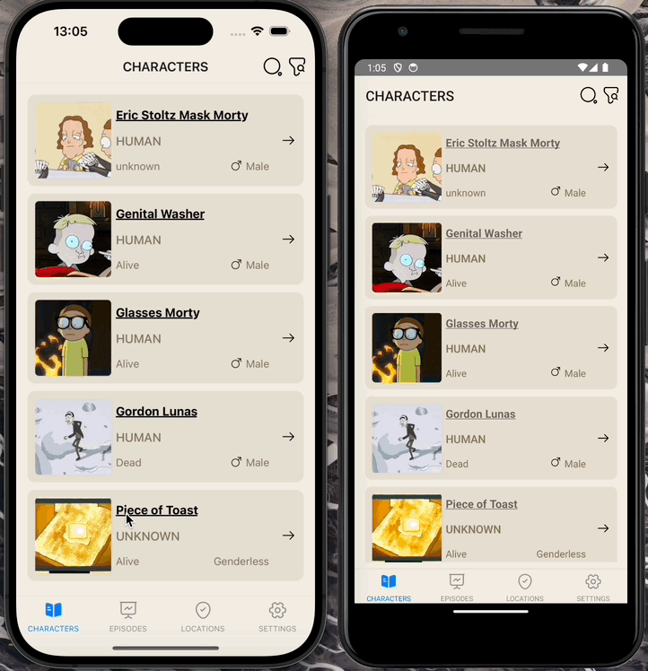

# Rick and Morty Karakterleri Uygulaması

Bu proje, Rick and Morty dizisinin karakterlerini listeleyen ve detaylarını gösteren bir React Native uygulamasıdır. Uygulama, karakterleri listeleme, arama, filtreleme ve karakter detaylarını görüntüleme gibi özellikler sunar.

## Özellikler

- Karakterleri listeleme
- Karakter detaylarını görüntüleme
- Karakterleri ada göre arama
- Karakterleri cinsiyet ve duruma göre filtreleme

## Kullanılan Teknolojiler

- React Native
- Redux
- Axios
- React Navigation
- Rick and Morty API

### Karakterleri Listeleme

Uygulama açıldığında, Rick and Morty dizisinin karakterleri listelenecektir. Liste üzerinde kaydırarak daha fazla karakteri görüntüleyebilirsiniz.

### Karakter Arama

- Ekranın üst kısmındaki arama çubuğunu kullanarak karakterleri ada göre arayabilirsiniz.
- Arama butonuna basarak veya klavyeden "Enter" tuşuna basarak arama işlemini gerçekleştirebilirsiniz.

### Karakter Filtreleme

- Karakterleri cinsiyet (male, female, unknown) ve durum (alive, dead, unknown) kriterlerine göre filtreleyebilirsiniz.
- Filtreleme butonlarını kullanarak bu işlemleri gerçekleştirebilirsiniz.

### Karakter Detayları

- Listeden bir karaktere tıklayarak karakterin detay sayfasına gidebilirsiniz.
- Detay sayfasında karakterin adı, cinsiyeti, türü, durumu, kökeni ve mevcut konumu gibi bilgileri görüntüleyebilirsiniz.

## API

Bu proje, Rick and Morty API'sini kullanmaktadır. Daha fazla bilgi için [Rick and Morty API Dokümantasyonu](https://rickandmortyapi.com/documentation) sayfasını ziyaret edebilirsiniz.

## Ekran Görüntüsü

